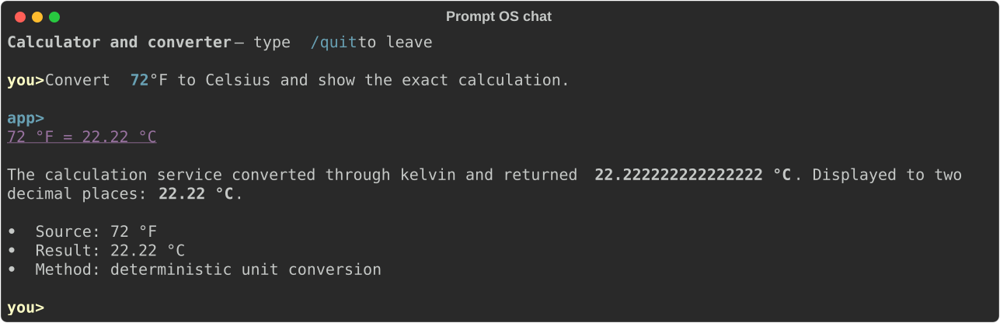
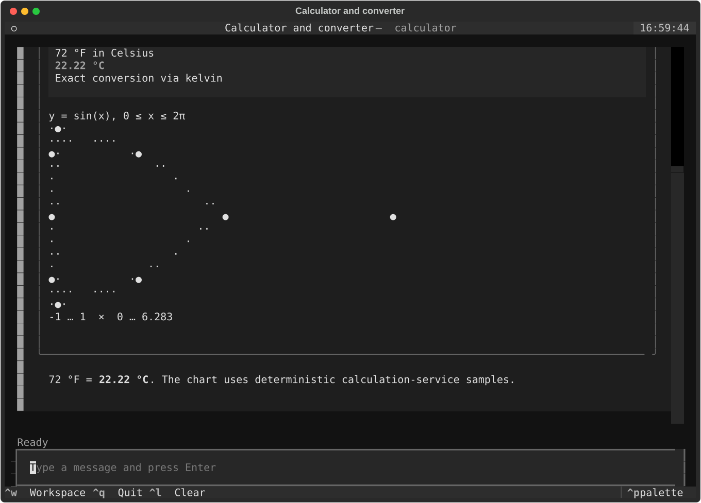
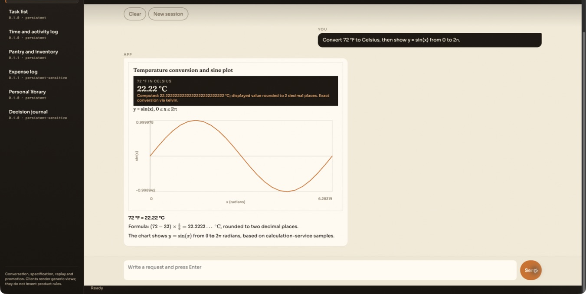

# Prompt OS

Most “AI apps” hide their product in a prompt. The prompt accretes exceptions, the totals are whatever the model typed, and nobody can say what the service actually does without reading a conversation.

Prompt OS inverts that. The product is an English business specification. Code is a generic harness: storage, clocks, arithmetic, traces, versioning, and presentation. A language model operates the specification; it does not own the facts.

A product owner should be able to read `apps/*/FUNCTIONALITY.md` and recognise the service. They should not need to know what a tool call is.

## One harness, three clients

The same application packs run in a focused command-line chat, a full-screen terminal UI, and a local browser desk. Each client renders the same generic replies and view descriptions; none of them contains an application-specific workflow.

### Chat

The lightweight REPL keeps the model conversation close to the shell while Rich renders readable Markdown replies.



### Terminal UI

The Textual client adds native metrics, tables and charts, plus a structured workspace for repeated data entry.



### Web UI

The local operator desk combines conversation and generic visualizations with records, specifications, replay, evaluation and explicit promotion controls.



## Why

Three failure modes show up as soon as a small application is “just a prompt”:

1. **The behaviour is not reviewable.** Persona text, tool hints and edge-case patches get mixed into one blob. Changing “how we classify lunch” looks like prompt engineering instead of a product decision.
2. **The model is asked to be a calculator and a database.** Totals drift. Dates depend on the model’s idea of “today”. A correction overwrites history because there is no history.
3. **The UI becomes the workflow.** An expense screen, a task screen, a library screen — each one re-encodes rules the specification already stated. Then the terminal, the browser and the API disagree.

This repository treats those as harness bugs, not application features.

So:

- Product rules live in ordinary language, in a shape a human can diff.
- Numbers, clocks and aggregates come from deterministic services.
- Documents are JSON with an append-only revision log. There is no hand-authored business schema on day one.
- The live conversation can *use* the product. It cannot *promote* a new specification or a new data contract.
- Clients render generic views. They do not contain “expense” or “task” workflows.

The model is still necessary. It interprets messy requests, chooses tools, and writes prose. It is not the source of truth.

## What an application is

An application is a pack under `apps/`, not a Python module.

```text
apps/expense-log/
  app.json              capabilities, version, data policy
  FUNCTIONALITY.md      purpose, services, operating rules, examples
  versions/0.1.0/       archived production snapshot after a promotion
```

`app.json` names the pack and which fundamental capabilities it may use. It does not list fields, SQL, or model instructions.

`FUNCTIONALITY.md` is the product. A typical file has four sections, plus an optional interface:

- **Purpose** — what the service is for.
- **Services** — what a user can ask it to do.
- **Operating rules** — constraints that must hold even when the request is informal.
- **Interface** — what to capture and what to show, in ordinary language. This is enough to distill forms and views; it is not a layout file and does not go through contract promotion.
- **Acceptance examples** — observable outcomes, not target wording.

The calculator pack says the displayed result comes from the calculation service, not an estimate. The expense pack says decimal precision is preserved and totals keep currencies separate. Those are business rules. They are allowed to mention “aggregation service” as a capability of the world; they are not allowed to say “call `store.aggregate`” or “you are a helpful assistant”.

The harness refuses packs that talk like prompts (`system prompt`, `chain of thought`, `call the tool`). That is deliberate. If the specification starts steering the model, the product has leaked into the runtime.

Seven packs are included. They are a test ladder for the harness, not a suite of products to productise:

| Application | What it exercises |
|---|---|
| Calculator and converter | Deterministic arithmetic and unit conversion, almost no memory |
| Task list | Create, update, reference and archive documents |
| Time and activity log | Relative dates, ambiguity, corrections, aggregates |
| Pantry and inventory | Repeated state, quantities, units, aliases |
| Expense log | Precision, classification, currencies, grouped totals |
| Personal library | Entity lifecycle, optional fields, retrieval |
| Decision journal | Shapeless capture first, structure later |

If the harness stays generic, a new pack is a directory and a specification. It is not a new screen and not a new schema file.

## How the runtime stays generic

`src/prompt_os/` must not know the names of applications, their fields, or their workflows. `contracts/` describes tools every app can share. `apps/` is the only place product decisions belong.

On each turn the model receives:

1. A short generic operating policy (“only do what the specification describes; do not invent stored facts or calculated values”).
2. The current `FUNCTIONALITY.md`.
3. The subset of MCP tools allowed by the pack’s capabilities.

The shared tool server is intentionally boring:

| Block | Tools | Why they exist |
|---|---|---|
| Clock | `system.now` | “Yesterday” needs a timezone, not a guess |
| Documents | `store.put` / `get` / `query` / `scan` / `archive` / `history` | JSON in, JSON out, with revisions |
| Retrieval | `store.search` | Deterministic term matching |
| Aggregation | `store.aggregate` | Counts and sums the model must not invent |
| Calculation | `math.evaluate`, `math.sample` | Bounded arithmetic, elementary functions, and sampled curves |
| Conversion | `unit.convert` | Compatible measurements only |
| Contract | `contract.current` / `evidence` / `propose` | Structure is earned, then reviewed |
| Presentation | `view.present` | Optional generic view for capable clients |

There is no `promote` tool on the live agent. Promotion is an operator action after replay. That is the whole governance model in one sentence: generation is cheap; production changes are explicit.

Strands owns the conversation loop, tool iteration and the LiteLLM adapter. Prompt OS owns the specification, the store, traces, contract lifecycle and the decision of whether a candidate is allowed to become production. The harness does not grow a second agent framework, and application names do not leak into Strands configuration.

## How data earns a shape

A new application has no business schema. Early records go into a loose `inbox` collection. That is uncomfortable on purpose. You should not have to invent `merchant`, `amount_minor` and `category_id` before anyone has stored a lunch.

After there is evidence — documents, corrections, failed queries, the specification itself — the live app may *propose* a contract. A proposal has to cite immutable evidence identifiers. A required field needs three document revisions that actually contain a value of the declared type. The harness understands only the generic contract format. Collection names and field names are generated artifacts of that application, not types in `prompt_os`.

```text
functionality + inbox records + corrections
        ↓
  candidate contract
        ↓
  structural checks + hash-bound replay
        ↓
  explicit promotion
        ↓
  current contract used by storage and reporting
```

Until promotion, `store.put` stays loose. After promotion, new records must fit the current contract. The live conversation still cannot promote. `prompt-os contract` (or the Contract tab in the web desk) replays the candidate against its evidence and content hash, then asks. A Boolean “looks good” is not enough; promotion consumes the persisted replay report.

Current documents are a projection. Every put or archive appends a revision. You can restore an earlier contract because production history is not rewritten.

## How the specification is allowed to change

Traces are the memory of what actually happened. Persistent apps keep full local JSONL. Sensitive apps keep metadata without payloads. Optional-history apps keep nothing — the calculator is in that last group, because a conversion does not need a diary.

`prompt-os improve` reads recent traces, proposes at most one narrow change to `FUNCTIONALITY.md`, and replays the application’s business cases against both the current text and the candidate. The operator sees a diff and a per-case comparison.

A candidate that turns a passing baseline case into a failure cannot be promoted. Declining leaves production untouched. Approving archives `apps/<app>/versions/<version>/`, installs the candidate, and bumps the patch version.

That is slower than editing a prompt in place. It is also how you keep “the product” from being whatever the last conversation implied.

Evaluations follow the same spirit. Cases ask for observable outcomes: required or forbidden tools, document counts, revision counts. They do not snapshot the model’s wording. Each case runs in an isolated temporary database. An eval run never promotes.

## How clients work

The model may call `view.present` with a small generic description: title plus blocks of text, metric, list, table or bar chart. The vocabulary has no application fields in it. A terminal can draw a table as a grid; a browser can draw the same block as HTML and render LaTeX in the prose. Clients that do not understand views still get the textual reply.

That is why the TUI and the local web desk look like operator surfaces rather than an expense app. They pick a pack, talk to it, show its records as JSON, show its specification, and offer improve / contract / eval as explicit actions. Adding a “category picker” to the web UI would be a product decision in the wrong layer.

## Run it

From the checkout:

```bash
uv sync
uv run pytest
uv run prompt-os apps
uv run prompt-os show calculator
uv run prompt-os validate
```

Model-backed commands need a LiteLLM proxy. Copy `.env.example` to `.env`:

```dotenv
LITELLM_BASE_URL=http://localhost:4000
LITELLM_API_KEY=your-virtual-key
LITELLM_MODEL=your-model-alias
```

The CLI loads `.env` from the working directory. Exported shell variables win. The key is never read from an application pack and never written to a trace. Before a model-backed command starts, the harness checks that the alias is visible to the key and that it is a chat model with tool support. Sampling parameters are left to the provider, so proxies that only accept their default temperature still work.

Talk to an application:

```bash
uv run prompt-os chat activity-log --timezone Europe/Amsterdam
uv run prompt-os tui expense-log --timezone Europe/Amsterdam
uv run prompt-os web --open
```

The web desk binds to `127.0.0.1:8765` by default. From there you can converse, use a distilled workspace of forms and tables, inspect stored JSON by collection, read the specification, propose an improvement, review a contract, or run evaluations. Promotion still asks.

The **App** tab is how the product steps out of chat. Forms and views are distilled first from the specification’s Interface section, then from a promoted data contract, then from keys already stored. Recording a form writes the document store directly — the language model is not in that path. The TUI exposes the same surface with `Ctrl+W`. Conversation remains for messy requests; the workspace is for repeating structured work.

Data stays in the checkout and out of git:

| Path | What it is |
|---|---|
| `var/prompt-os.sqlite` | Application-scoped documents and revisions |
| `var/traces/<app>.jsonl` | Turn traces, according to the pack’s data policy |
| `var/data-contracts/` | Generated contract candidates and the current contract |
| `var/improvements/` | Specification candidates plus their replay reports |

`--debug` on chat or TUI shows tool activity. The web desk has the same toggle.

## Review and promote

After the app has stored a few records and the model has proposed a contract:

```bash
uv run prompt-os contract expense-log
```

After traces show a repeated gap in the specification:

```bash
uv run prompt-os improve expense-log
```

Both print something a human can read, then wait for an explicit yes. There is no path from a live user message to overwriting `FUNCTIONALITY.md`.

Run the opt-in model evaluations the same way:

```bash
uv run prompt-os eval
uv run prompt-os eval --app activity-log
uv run prompt-os eval --suite contracts
uv run prompt-os eval --suite all
```

`smoke` checks that the apps can do the jobs in their acceptance examples. `contracts` checks that grounded contract candidates can be generated. Neither suite installs anything.

## Layout

```text
apps/            reviewable products
src/prompt_os/   generic harness (no application names)
contracts/       tool catalog and contract schema
eval/            business cases, not golden replies
tests/           outcomes and invariants
var/             local data, traces, candidates
```

`DESIGN.md` is the working design. `AGENTS.md` is the engineering constitution — the short list of rules this README is explaining.

The interesting code is not a clever prompt. It is the boundary: English for product, deterministic services for facts, candidates for change, and a human for production.
